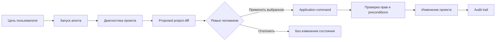

# KISS PM

[](#статус-проекта)
[](#технологический-стек)
[](https://pnpm.io/)
[](#документация)

**KISS PM** — агентная SaaS/self-hosted платформа для управления проектами, ресурсной загрузкой и управленческими действиями.

Главный рабочий цикл продукта:

```txt
цель → запуск агента → proposed project diff → ревью → применение → аудит
```

KISS PM не пытается стать еще одной доской задач или BI-панелью. Продукт ведет пользователя от намерения к проверяемому изменению проекта: агент готовит структурированный diff, человек выбирает, что применить, система проверяет права и сохраняет след решения.

---

## Что внутри

- **Agent-first project management** — проектный агент готовит изменения, но не меняет состояние без ревью.
- **Project diff / Сверка** — задачи, сроки, владельцы, зависимости, риски и сообщения видны до применения.
- **Управленческий контроль** — важные действия проходят права, preconditions и audit trail.
- **Планирование и ресурсы** — Gantt/WBS, задачи, роли, capacity, resource matrix и KPI строятся на единой модели.
- **Founder-beta runtime** — рабочие маршруты с реальными API contracts, PostgreSQL persistence, RBAC и E2E/QA gate.



## Статус проекта

Репозиторий уже содержит рабочую Node + pnpm монорепо-реализацию и остается **docs-first** по архитектурным решениям.

Текущий фокус: **founder-beta / runtime readiness** — не декоративные экраны, а проверяемые маршруты с реальными данными, действиями, правами, аудитом и screenshot/runtime evidence.

## Технологический стек

| Слой | Технологии |
|---|---|
| Backend | Node.js, Hono, OpenAPI/Scalar |
| Frontend | Next.js App Router, React, TypeScript |
| Persistence | PostgreSQL, Drizzle |
| UI | design-v3 tokens, BEM-oriented styles, Storybook catalog |
| Testing | Vitest, Playwright, runtime QA gates |
| Monorepo | pnpm workspaces |

## Структура репозитория

```txt
apps/
  api/       Node/Hono backend, OpenAPI, RBAC, audit, runtime routes
  web/       Next.js runtime UI, workspace shell, design-v3 screens
  landing/   marketing-facing landing experiments

packages/
  domain/                 доменная модель
  access-control/         права и access checks
  persistence/            PostgreSQL/Drizzle schema и migrations
  planning-client/        planning API client/contracts
  planning-gantt-ui/      Gantt/planning UI package
  tenant-org-structure/   оргструктура tenant/workspace
  test-fixtures/          детерминированные фикстуры

docs/        canonical product, architecture, API, beta, runbook и marketing docs
e2e/         Playwright smoke, runtime, planning и a11y проверки
scripts/     dev seed, runtime QA и security automation
```

## Быстрый старт

### 1. Установить зависимости

```bash
pnpm install
```

### 2. Запустить полный dev runtime через Docker Compose

```bash
pnpm dev:compose
```

Команда поднимает PostgreSQL, API и web, применяет миграции, выполняет dev seed и держит frontend/backend включенными для live reload.

Для фонового режима:

```bash
pnpm dev:compose:detached
```

### 3. Открыть приложение

| Сервис | URL |
|---|---|
| Web | `http://127.0.0.1:3000` |
| API | `http://127.0.0.1:4000` |
| PostgreSQL | `127.0.0.1:55432` |

Dev-вход после seed:

```txt
admin@kiss-pm.local / local-admin-password
```

Пример окружения без секретов находится в `.env.example`.

## Ручной запуск слоев

```bash
pnpm db:up
pnpm db:generate
pnpm db:migrate
pnpm db:seed:dev
pnpm dev:api
pnpm dev:web
```

Остановить локальный PostgreSQL слой:

```bash
pnpm db:down
```

## Проверки

| Команда | Что проверяет |
|---|---|
| `pnpm typecheck` | TypeScript project references |
| `pnpm test` | unit/integration tests через Vitest |
| `pnpm test:db` | DB-backed тесты |
| `pnpm test:e2e:smoke` | основной browser/API smoke |
| `pnpm qa:runtime` | runtime QA gate для beta routes |
| `pnpm verify:storybook-contract` | Storybook/design-v3 contract |
| `pnpm security:check` | backend security audit + scan |
| `pnpm qa:release` | полный release-like gate |

Playwright smoke поднимает изолированные web/API процессы на `127.0.0.1:3100` и `127.0.0.1:4100`, чтобы не переиспользовать случайно запущенный dev runtime. Порты можно переопределить через `E2E_WEB_PORT` и `E2E_API_PORT`.

## Документация

Главный вход: [`docs/README.md`](docs/README.md).

Ключевые разделы:

- [`docs/api/`](docs/api/) — frontend-facing API conventions, OpenAPI coverage и screen recipes.
- [`docs/design-v3/`](docs/design-v3/) — визуальный контракт, токены, Storybook правила и shadcn overrides.
- [`docs/runbooks/`](docs/runbooks/) — backend operations, self-hosted deployment и E2E smoke.
- [`docs/plans/`](docs/plans/) — активные планы реализации и улучшений.
- [`docs/status/`](docs/status/) — ledger/status документы, evidence и история закрытых фаз.
- [`AGENTS.md`](AGENTS.md) — обязательные правила для agent/агентов в этом репозитории.

## Принципы разработки

1. Сначала документация и контракт, затем реализация.
2. Runtime UI не показывает fake/demo controls без рабочего сценария или явного disabled reason.
3. Существенное изменение состояния проходит `proposal → confirmation → result/audit`.
4. Tenant-специфичные роли, стадии, KPI, поля и названия живут в настройках, не в коде.
5. CRM, Bitrix24, AmoCRM, Jira, Slack, email и MS Project — интеграционные адаптеры, не ядро домена.
6. Любая beta/runtime доработка должна иметь targeted verification: тест, E2E, screenshot или документированный blocker.

## Лицензия

Лицензия в репозитории не указана.
