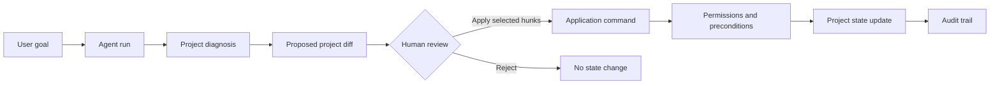

# KISS PM

[](#project-status)
[](#technology-stack)
[](https://pnpm.io/)
[](LICENSE)

**KISS PM** is an agent-first project management platform for project operations, resource planning, governed changes, and auditability.

The core product loop is simple:

```txt
goal → agent run → proposed project diff → human review → apply → audit
```

KISS PM is not another task board with an AI chat bolted on. It turns intent into reviewable project changes: the agent prepares a structured diff, the user chooses what to apply, the system checks permissions and preconditions, and every important change leaves an audit trail.

---

## Why this project exists

Most project management tools are good at showing work, but weak at moving it forward safely. After meetings, delays, and risks, managers still collect context manually, update tasks, move dates, reassign owners, write follow-ups, and explain consequences.

KISS PM explores a different workflow:

- the user states a project goal or problem;
- the agent diagnoses the current state;
- proposed changes are shown as a project diff;
- the user reviews, edits, accepts, or rejects individual hunks;
- accepted changes go through application commands, permission checks, and audit logging.



## What is included

- **Agent-first project workflow** — the agent prepares changes, but does not silently mutate project state.
- **Project diff review** — tasks, dates, owners, dependencies, risks, and messages are visible before they are applied.
- **Governed actions** — important mutations pass through permissions, stale-state checks, and audit records.
- **Planning and resources** — Gantt/WBS, tasks, roles, capacity, resource matrix, and KPI/control signals share one product model.
- **SaaS and self-hosted direction** — the architecture keeps future hosted and self-hosted deployments in scope.

## Project status

KISS PM is in **founder-beta / runtime readiness** development.

The repository already contains a Node + pnpm monorepo implementation, while product and architecture decisions remain docs-first. Current work focuses on real runtime routes with API contracts, PostgreSQL persistence, RBAC, audit records, QA gates, and browser evidence.

This is an active early-stage project. Expect implementation churn, but not placeholder-first product direction.

## Technology stack

| Layer | Technologies |
|---|---|
| Backend | Node.js, Hono, OpenAPI/Scalar |
| Frontend | Next.js App Router, React, TypeScript |
| Persistence | PostgreSQL, Drizzle |
| UI | design-v3 tokens, BEM-oriented styles, Storybook catalog |
| Testing | Vitest, Playwright, runtime QA gates |
| Monorepo | pnpm workspaces |

## Repository structure

```txt
apps/
  api/       Node/Hono backend, OpenAPI, RBAC, audit, runtime routes
  web/       Next.js runtime UI, workspace shell, design-v3 screens
  landing/   marketing-facing landing experiments

packages/
  domain/                 domain model
  access-control/         permission and access checks
  persistence/            PostgreSQL/Drizzle schema and migrations
  planning-client/        planning API client/contracts
  planning-gantt-ui/      Gantt/planning UI package
  tenant-org-structure/   tenant/workspace organization model
  test-fixtures/          deterministic test fixtures

docs/        product, architecture, API, runbook, planning, and status docs
e2e/         Playwright smoke, runtime, planning, and accessibility checks
scripts/     dev seed, runtime QA, and security automation
```

## Quick start

### Prerequisites

- Node.js compatible with the workspace TypeScript toolchain
- pnpm 10.33.2
- Docker and Docker Compose for the local PostgreSQL-backed runtime

### Install dependencies

```bash
pnpm install
```

### Start the full local runtime

```bash
pnpm dev:compose
```

This starts PostgreSQL, API, and web, applies migrations, runs the development seed, and keeps frontend/backend services running with live reload.

For detached mode:

```bash
pnpm dev:compose:detached
```

### Open the app

| Service | URL |
|---|---|
| Web | `http://127.0.0.1:3000` |
| API | `http://127.0.0.1:4000` |
| PostgreSQL | `127.0.0.1:55432` |

Development seed login:

```txt
admin@kiss-pm.local / admin12345
```

A secret-free environment example is available in `.env.example`.

## Manual service workflow

```bash
pnpm db:up
pnpm db:generate
pnpm db:migrate
pnpm db:seed:dev
pnpm dev:api
pnpm dev:web
```

Stop the local PostgreSQL layer:

```bash
pnpm db:down
```

## Verification

| Command | Purpose |
|---|---|
| `pnpm typecheck` | TypeScript project references |
| `pnpm test` | Vitest unit/integration tests |
| `pnpm test:db` | DB-backed tests |
| `pnpm test:e2e:smoke` | Browser/API smoke tests |
| `pnpm verify:storybook-contract` | Storybook/design-v3 contract gate |
| `pnpm security:check` | Backend security audit and scan |

Playwright smoke tests start isolated web/API processes on `127.0.0.1:3100` and `127.0.0.1:4100` so they do not accidentally reuse an already-running development runtime. Override ports with `E2E_WEB_PORT` and `E2E_API_PORT` when needed.

## Documentation

Start with [`docs/README.md`](docs/README.md).

Key areas:

- [`docs/api/`](docs/api/) — frontend-facing API conventions, OpenAPI coverage, and screen recipes.
- [`docs/design-v3/`](docs/design-v3/) — visual contract, tokens, Storybook rules, and shadcn overrides.
- [`docs/runbooks/`](docs/runbooks/) — backend operations, self-hosted deployment, and E2E smoke.
- [`docs/plans/`](docs/plans/) — active implementation and improvement plans.
- [`docs/status/`](docs/status/) — status ledgers, evidence, and closed phase history.
- [`AGENTS.md`](AGENTS.md) — repository rules for Codex/agent work.

## Open source and Codex for OSS readiness

This repository is prepared as an open-source project under the [Apache License 2.0](LICENSE).

For maintainers applying to the [Codex for Open Source Program](https://developers.openai.com/codex/codex-for-oss-terms), this README makes the expected project facts explicit:

- the project license is visible and permissive;
- the repository purpose, scope, stack, setup, and verification commands are documented;
- maintainers can point reviewers to active docs, runbooks, plans, and status evidence;
- security or code review activity should only be run on repositories the maintainer owns, maintains, or is authorized to administer;
- application materials should not include confidential information.

Nothing in this README states or implies approval by OpenAI. Program participation is subject to OpenAI's own eligibility, verification, and selection process.

## Development principles

1. Documentation and contracts first, implementation second.
2. Runtime UI must not expose fake controls without a working scenario or explicit disabled reason.
3. Significant state changes follow `proposal → confirmation → result/audit`.
4. Tenant-specific roles, stages, KPI definitions, fields, and labels live in configuration, not hardcoded product logic.
5. CRM, Bitrix24, AmoCRM, Jira, Slack, email, and MS Project are integration adapters, not the core domain.
6. Any beta/runtime change needs targeted verification: a test, E2E run, screenshot, or documented blocker.

## Contributing

Issues and pull requests are welcome when they preserve the product direction: reviewable project changes, human confirmation, permission checks, and auditability. For larger changes, start from the relevant docs and keep the implementation slice small, testable, and grounded in existing architecture.

## License

KISS PM is licensed under the [Apache License 2.0](LICENSE).
