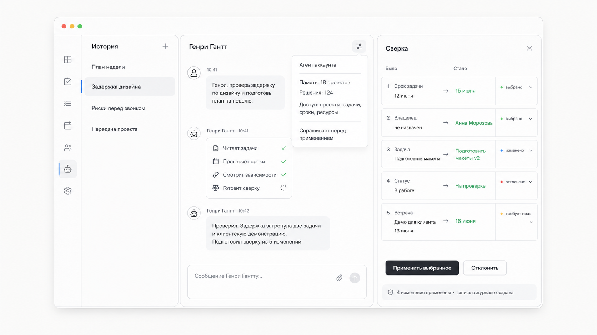

# Спецификация интерактивного демо лендинга

## Статус

Документ фиксирует отдельную спецификацию центрального интерактивного блока лендинга KISS PM.

Это не общий лендинг и не продуктовый экран. Это **лендинговая витрина рабочего интерфейса**: пользователь пишет Генри, агент думает, справа появляется `Сверка`, человек ревьюит и применяет выбранные изменения.

## Референсный мокап

Мокап ниже является направлением, а не пиксельным контрактом. В финальном дизайне окно должно быть просторнее и не так близко к краям композиции.



Блокер PNG: перед реализацией/публикацией регенерировать; у Генри остались `Память: 18 проектов`, `Решения: 124`.

## Главный принцип

Минимализм. Минимализм. Минимализм.

На лендинге вокруг блока не должно быть:

- заголовка слева;
- CTA рядом с демо;
- маркетингового описания;
- графиков-дашбордов;
- AI-орбов, свечений, “future brain” и похожей визуальной мишуры.

Почти пустой фон. В центре - одно большое окно KISS PM.

## Что за блок

Интерактивный блок показывает один сценарий:

```txt
пользователь отправляет запрос
  -> Генри Гантт думает
  -> Генри читает задачи, сроки, зависимости и загрузку
  -> Генри отвечает коротко и по-русски
  -> справа выезжает Сверка
  -> пользователь выбирает, меняет, отклоняет и применяет изменения
  -> появляется запись в журнале
  -> пользователь может отправить второй запрос
```

## Размер и композиция

Окно должно быть достаточно вместительным и спокойным.

На desktop:

- ширина окна: ориентир `1120-1280px`;
- высота окна: ориентир `660-760px`;
- вокруг окна остается воздух, не приближать его к краям viewport;
- окно центрируется по горизонтали;
- на 1440px viewport окно не должно ощущаться тесным;
- на широких экранах не растягивать контент до абсурда, использовать max-width.
- правая `Сверка` должна дышать: без тесных строк `Было` / `Стало`, без крупных заголовков, без сжатых карточек.

Композиция окна:

```txt
┌──────────────────────────────────────────────────────────────────────────────┐
│ │ История       │ Генри Гантт                         │ Сверка              │
│ │               │                                     │                    │
│ │ План недели   │  чат                                │ было / стало        │
│ │ Задержка      │  действия Генри                     │ изменения           │
│ │ Риски         │  ответ                              │ статусы             │
│ │ Передача      │  ввод сообщения                     │ apply / reject      │
│ │               │                                     │ журнал              │
└──────────────────────────────────────────────────────────────────────────────┘
  ↑
  совсем слева внутри окна: свернутое меню приложения, только иконки
```

## Свернутое меню приложения

Совсем слева внутри окна находится свернутая навигация приложения.

Она должна ссылаться на существующий web app chrome из Storybook:

- визуально ориентироваться на текущий Storybook web app / `Views/Screens`;
- сверяться с `apps/web/src/views/screens/screens.stories.tsx`;
- использовать подход `WorkspaceChrome` / `AppSidebar` как основу визуальной дисциплины;
- не изобретать отдельную новую навигацию для лендинга.

Файлы-референсы:

- `docs/design-v3/MOCKUPS.md`
- `apps/web/src/views/screens/screens.stories.tsx`
- `apps/web/src/views/layout/workspace-chrome.tsx`
- `apps/web/src/shell/app-sidebar.tsx`
- `apps/web/src/views/config/sidebar-nav.ts`

Состояния:

1. `Свернуто`: только иконки.
2. `Раскрыто`: узкая панель с подписями.

Пункты меню:

- Агент;
- Проекты;
- Задачи;
- Ресурсы;
- Сроки;
- Отчеты;
- Настройки.

Активный пункт: `Агент`.

Раскрытие меню нужно для интерактива, но меню остается вторичным. Оно не должно перетягивать внимание с чата и Сверки.

## Левая колонка внутри окна: история

В демо и закрытой альфе показываем одного агента аккаунта. Это не фиксирует постоянное ограничение продукта.

Левая колонка показывает историю диалогов / запусков Генри:

- `План недели`;
- `Задержка дизайна` - активный;
- `Риски перед звонком`;
- `Передача проекта`.

Заголовок:

```txt
История
```

Колонка тихая, узкая, без лишних controls.

## Агент

Имя агента:

```txt
Генри Гантт
```

Позиционирование агента в демо:

- один агент аккаунта в текущей альфа-модели;
- помнит контекст текущего демо;
- имеет показанные в демо доступы;
- полные настройки живут в настройках аккаунта.

Тон:

- живо-деловой русский;
- без англицизмов в UI-сообщениях;
- без сильного жаргона;
- короткие, уверенные фразы;
- как хороший senior PM, а не корпоративный робот.

Пример хорошего ответа:

```txt
Проверил. Задержка затронула две задачи и клиентскую демонстрацию. Подготовил сверку из 5 изменений.
```

## Быстрый dropdown Генри

В шапке чата рядом с именем `Генри Гантт` есть маленькая кнопка настроек.

По клику открывается компактный dropdown:

```txt
Генри Гантт
Агент аккаунта

Память
Контекст демо-проектов
История решений в примере

Доступ
Проекты, задачи, сроки, ресурсы

Поведение
Спрашивает перед применением

Настроить в аккаунте →
```

В этом dropdown только быстрые сведения. Полноценное изменение имени, памяти, доступов, поведения и `soul.md` живет в глобальных настройках аккаунта.

## Начальное состояние демо

В центре чат с Генри.

В строке ввода уже набран текст:

```txt
Генри, проверь задержку по дизайну и подготовь план на неделю.
```

Пользователь может отправить его:

- клавишей `Enter`;
- кнопкой отправки.

До отправки правая панель `Сверка` не видна. Центральный чат занимает больше места.

## Состояние после отправки

После отправки:

1. Сообщение пользователя появляется в чате.
2. Генри переходит в состояние thinking.
3. Показывается живая последовательность действий:

```txt
Читает задачи
Проверяет сроки
Смотрит зависимости
Сверяет загрузку
Готовит сверку
```

Требования к thinking:

- максимально живое;
- не просто один loader;
- шаги появляются последовательно;
- у каждого шага есть короткая спокойная анимация;
- можно использовать иконку, точку, прогресс-линию или мягкую подсветку;
- не использовать “магический AI” визуал.

После действий Генри отвечает:

```txt
Проверил. Задержка затронула две задачи и клиентскую демонстрацию. Подготовил сверку из 5 изменений.
```

## Правая панель: Сверка

Слово `diff` в UI не использовать.

Правый блок называется:

```txt
Сверка
```

Панель появляется только после первого ответа Генри.

Анимация появления:

- панель выезжает справа как новая рабочая область;
- центр плавно сжимается;
- opacity 0 -> 1;
- duration ориентир `220-320ms`;
- easing спокойный `ease-out`;
- без дерганья layout.

Это должно ощущаться как боковая review-панель, а не как модалка.

## Структура Сверки

Сверка — главный proof блока. Ценность не в графиках и не в дашбордах, а в контролируемых изменениях проекта через ревью человеком.

Обязательные элементы:

- заголовок `Сверка`;
- счетчик `5 изменений`;
- метки статусов;
- строки `Было` / `Стало`;
- список изменений;
- действия `Применить выбранное`, `Отклонить`, `Изменить`;
- audit strip после применения.

Примеры изменений:

```txt
1. Срок задачи
Было: 12 июня
Стало: 15 июня

2. Владелец
Было: не назначен
Стало: Анна Морозова

3. Задача
Было: Подготовить макеты
Стало: Подготовить макеты v2

4. Статус
Было: В работе
Стало: На проверке

5. Встреча
Было: Демо для клиента, 13 июня
Стало: Демо для клиента, 16 июня
```

## Статусы изменений

Статусы показывать очень тихо:

- `выбрано`;
- `изменено`;
- `отклонено`;
- `требует прав`;
- `устарело`;
- `применено`.

Визуально:

- маленькая метка;
- спокойная точка;
- тонкая полоска;
- минимум цвета;
- без ярких badge-плашек.

## Интерактивность Сверки

Это должна быть реальная интерактивность на локальном mock state.

Обязательные действия:

- выбрать / снять изменение;
- выделить изменение;
- отклонить изменение;
- изменить значение `Стало`;
- применить выбранное;
- сбросить демо.

Редактирование делать как в review-интерфейсе Cursor-подобного типа:

- пользователь нажимает `Изменить`;
- значение `Стало` становится inline-editable;
- для дат показывать поле даты или компактный date picker;
- для владельца - компактный select;
- для решения / текста - inline textarea;
- после изменения статус становится `изменено`;
- рядом тихо видно, что пользователь правил предложение Генри.

## Применение выбранного

При клике `Применить выбранное`:

1. Кнопка кратко показывает `Применяем...`.
2. Выбранные изменения получают статус `применено`.
3. Внизу панели появляется audit strip:

```txt
4 изменения применены · запись в журнале создана
```

4. Генри пишет в чат:

```txt
Готово. Применил 4 изменения и оставил запись в журнале. Одно изменение осталось отклоненным.
```

Это локальное демо-состояние. Не делать вид, что изменения реально ушли в backend.

## Второй запрос

После применения пользователь может написать второй запрос.

На второй запрос:

- Генри снова показывает thinking;
- снова показывает чтение задач / сроков / зависимостей;
- в первой версии не обязательно генерировать вторую Сверку;
- важно доказать, что чат живой, а не одноразовая анимация.

## Mobile behavior

Mobile продумать как два drawer-слоя.

На mobile:

- центральный чат остается основным экраном;
- свернутое меню открывается как левый drawer;
- `Сверка` открывается как правый drawer или full-height sheet поверх чата;
- одновременно два drawer не открывать;
- при открытой Сверке чат остается видимым частично или доступен по закрытию;
- список истории можно спрятать за кнопкой `История`;
- actions в Сверке должны быть доступны большим пальцем;
- hunks идут вертикальными карточками;
- редактирование `Стало` не должно ломать высоту карточки.

Рекомендуемая mobile-схема:

```txt
[верхняя строка: меню · Генри Гантт · Сверка]
[чат]
[ввод]

левый drawer: меню + история
правый drawer: Сверка
```

## Close-up блоки ниже главного демо

После главного интерактивного демо нужны 2-3 дополнительных close-up блока максимум. Они не должны превращать страницу в каталог функций.

Цель close-ups: показать, что KISS PM - не только агентный чат, но и проектная система с задачами, сроками, ресурсами, журналом и настройками.

Рекомендуемые 3 блока:

### 1. Сверка как review изменений

Крупный close-up правой панели:

- `Было` / `Стало`;
- статус изменения;
- inline edit даты;
- тихая метка `требует прав`;
- audit strip.

Смысл: агент не меняет проект вслепую.

### 2. Контекст проекта

Close-up того, откуда Генри берет контекст:

- задачи;
- сроки;
- зависимости;
- загрузка;
- риск;
- клиентская демонстрация.

Смысл: агент не просто пишет текст, он читает проектные поверхности.

### 3. Журнал решений

Close-up записи после применения:

- кто применил;
- что изменилось;
- было / стало;
- источник: Генри Гантт;
- время;
- причина.

Смысл: решения остаются проверяемыми.

Форма CTA на закрытую альфу идет отдельно и не входит в эти 2-3 close-ups.

## Storybook

Storybook нужен как набор состояний **этого одного interactive landing demo**, а не как каталог всего продукта.

При этом компоненты проектировать так, чтобы позже их можно было переиспользовать в продукте.

Namespace:

```txt
Marketing/LandingAgentDemo/*
```

Stories:

1. `Initial`
2. `MessageDrafted`
3. `AgentThinking`
4. `ActivitySteps`
5. `ReviewPanelOpening`
6. `ReviewPanelOpen`
7. `ChangeSelected`
8. `ChangeEditingDate`
9. `ChangeEditingDecision`
10. `ChangeRejected`
11. `PermissionRequired`
12. `ChangesApplied`
13. `AgentDropdownOpen`
14. `AppNavCollapsed`
15. `AppNavExpanded`
16. `MobileLeftDrawer`
17. `MobileReviewDrawer`
18. `SecondPromptThinking`
19. `ResetDemo`

Storybook должен:

- использовать русские видимые тексты;
- показывать реальные состояния, а не статичные картинки;
- иметь отдельный state для раскрытого меню как в Storybook web app;
- иметь отдельные mobile states;
- не добавлять stories для всего продукта;
- не подменять текущий `Views/Screens`, а жить как отдельная marketing story-группа.

## Компонентная структура

Контейнер:

```txt
LandingAgentDemo
```

Переиспользуемые визуальные части:

```txt
AgentWorkspaceFrame
CollapsedAppNav
AgentConversationList
AgentChatPanel
AgentActivitySteps
ChangeReviewPanel
ChangeHunkCard
AgentStatusMenu
LandingDemoCloseups
```

Сценарий и mock-data:

```txt
landingAgentDemoScenario.ts
```

Важно:

- `LandingAgentDemo` остается маркетинговым контейнером;
- внутренние компоненты не должны быть одноразовыми декоративными div;
- не подключать backend;
- не использовать fake API;
- все state transitions локальные и честные.

## Design-v3 и Storybook web app reference

Соблюдать design-v3 lockdown:

- не использовать inline `style={{ ... }}`;
- не использовать hex / rgba в TSX;
- новые классы добавлять в `apps/web/src/styles/bem.css` или `apps/web/src/styles/widgets/<name>.css`;
- для primitives использовать существующие `components/ui`;
- Storybook titles и visible names держать в русской структуре, как описано в `docs/design-v3/MOCKUPS.md`;
- левую навигацию сверять с текущим web app Storybook, а не рисовать новый брендовый sidebar.

## Copy rules

В UI использовать:

- `Сверка`;
- `Было`;
- `Стало`;
- `Выбрано`;
- `Изменено`;
- `Отклонено`;
- `Требует прав`;
- `Применить выбранное`;
- `Запись в журнале создана`;
- `Генри Гантт`;
- `Агент аккаунта`.

Не использовать в UI:

- `diff`;
- `agent run`;
- `AI-powered`;
- `автономный проектный менеджер`;
- `рост продуктивности`;
- `следующее поколение PM`;
- `магический AI`.

## Visual rules

- Светлая тема.
- Максимальный минимализм.
- Просторнее, чем текущий референсный мокап.
- Тонкие границы.
- Маленькая типографика.
- Много воздуха.
- Спокойные статусы.
- Никаких маркетинговых CTA внутри демо.
- Никаких hero-текстов слева.
- Никаких декоративных dashboard-графиков.
- Окно должно выглядеть как настоящий рабочий интерфейс.

## Definition of Done

Готово, если:

- на лендинге есть центральный интерактивный блок с Генри Ганттом;
- начальный запрос можно отправить;
- Генри показывает живые thinking/tool steps;
- справа с анимацией появляется `Сверка`;
- изменения можно выбирать, редактировать, отклонять и применять;
- даты и решения редактируются inline;
- после применения появляется запись в журнале;
- Генри пишет итоговое сообщение;
- пользователь может отправить второй запрос;
- левое меню можно раскрыть;
- меню визуально согласовано с Storybook web app chrome;
- dropdown Генри работает;
- mobile имеет левый drawer и drawer Сверки;
- ниже есть 2-3 close-up блока;
- Storybook покрывает состояния landing demo;
- UI минималистичный, светлый, русский;
- нет маркетингового hero-copy вокруг демо-окна.
